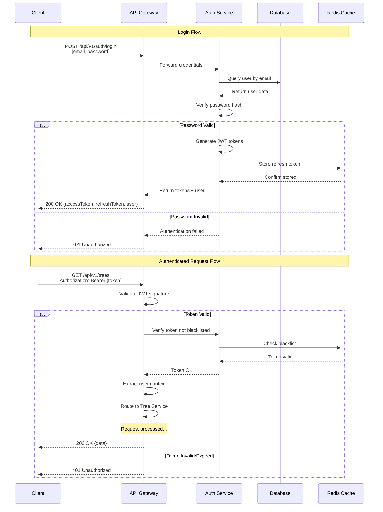

# API Architecture

## Table of Contents

- [Introduction](#introduction)
- [API Design Principles](#api-design-principles)
- [REST API Specifications](#rest-api-specifications)
- [API Endpoints](#api-endpoints)
- [Authentication & Authorization](#authentication--authorization)
- [Request/Response Formats](#requestresponse-formats)
- [Error Handling](#error-handling)
- [Versioning](#versioning)
- [Rate Limiting](#rate-limiting)
- [Documentation](#documentation)

## Introduction

This document defines the API architecture for TreeNetra, including REST endpoints, authentication mechanisms, and integration patterns.

### API Goals

- **Consistency**: Uniform design across all endpoints
- **Developer-Friendly**: Easy to understand and integrate
- **Secure**: Built-in security measures
- **Performant**: Optimized for speed
- **Well-Documented**: Comprehensive API documentation

## API Design Principles

### 1. RESTful Design

Follow REST principles:
- **Resources**: Use nouns for endpoints (e.g., `/trees`, `/users`)
- **HTTP Methods**: Use appropriate verbs (GET, POST, PUT, DELETE, PATCH)
- **Stateless**: Each request contains all necessary information
- **Cacheable**: Responses indicate cacheability
- **Layered**: Client doesn't know if connected directly to server

### 2. Resource Naming

```
✓ Good
/api/v1/trees
/api/v1/trees/:id
/api/v1/trees/:id/health-records
/api/v1/users/:id/profile

✗ Bad
/api/v1/getTrees
/api/v1/tree-delete
/api/v1/createNewUser
```

### 3. HTTP Methods

| Method | Purpose | Idempotent | Safe | Cacheable | Request Body | Response Body | Success Code |
|--------|---------|------------|------|-----------|--------------|---------------|-------------|
| **GET** | Retrieve resources | ✅ Yes | ✅ Yes | ✅ Yes | ❌ No | ✅ Yes | 200 OK |
| **POST** | Create resources | ❌ No | ❌ No | ⚠️ Rarely | ✅ Yes | ✅ Yes | 201 Created |
| **PUT** | Update/Replace | ✅ Yes | ❌ No | ❌ No | ✅ Yes | ✅ Yes | 200 OK |
| **PATCH** | Partial update | ⚠️ No* | ❌ No | ❌ No | ✅ Yes | ✅ Yes | 200 OK |
| **DELETE** | Remove resources | ✅ Yes | ❌ No | ❌ No | ⚠️ Optional | ⚠️ Optional | 204 No Content |
| **HEAD** | Get headers only | ✅ Yes | ✅ Yes | ✅ Yes | ❌ No | ❌ No | 200 OK |
| **OPTIONS** | Describe options | ✅ Yes | ✅ Yes | ❌ No | ❌ No | ✅ Yes | 200 OK |

*Note: PATCH can be idempotent depending on implementation

### 4. Status Codes

```
Success Codes:
- 200 OK: Successful GET, PUT, PATCH, DELETE
- 201 Created: Successful POST
- 204 No Content: Successful DELETE (no body)

Client Error Codes:
- 400 Bad Request: Invalid input
- 401 Unauthorized: Authentication required
- 403 Forbidden: Insufficient permissions
- 404 Not Found: Resource doesn't exist
- 409 Conflict: Resource conflict
- 422 Unprocessable Entity: Validation failed
- 429 Too Many Requests: Rate limit exceeded

Server Error Codes:
- 500 Internal Server Error: Server error
- 502 Bad Gateway: Upstream server error
- 503 Service Unavailable: Service down
- 504 Gateway Timeout: Upstream timeout
```

## REST API Specifications

### Base URL

```
Production: https://api.treenetra.com/v1
Staging: https://api-staging.treenetra.com/v1
Development: http://localhost:3000/api/v1
```

### Headers

#### Required Headers
```http
Content-Type: application/json
Accept: application/json
```

#### Authentication Header
```http
Authorization: Bearer <jwt_token>
```

#### Optional Headers
```http
X-Request-ID: <unique_request_id>
X-API-Version: v1
```

## API Endpoints

### Trees API

#### List Trees
```http
GET /api/v1/trees
```

**Query Parameters:**
- `page` (integer): Page number (default: 1)
- `limit` (integer): Items per page (default: 20, max: 100)
- `species` (string): Filter by species
- `healthStatus` (string): Filter by health status (healthy, needs_attention, critical)
- `location` (string): Filter by location
- `sort` (string): Sort field (createdAt, updatedAt, species)
- `order` (string): Sort order (asc, desc)

**Response:**
```json
{
  "success": true,
  "data": [
    {
      "id": "uuid",
      "species": "Oak",
      "commonName": "White Oak",
      "scientificName": "Quercus alba",
      "location": {
        "lat": 40.7128,
        "lng": -74.0060,
        "address": "Central Park, New York"
      },
      "plantedDate": "2020-05-15",
      "height": 15.5,
      "diameter": 2.3,
      "healthStatus": "healthy",
      "images": ["https://cdn.treenetra.com/images/abc123.jpg"],
      "tags": ["park", "deciduous"],
      "createdAt": "2025-01-15T10:30:00Z",
      "updatedAt": "2025-11-20T14:20:00Z"
    }
  ],
  "pagination": {
    "page": 1,
    "limit": 20,
    "total": 150,
    "totalPages": 8,
    "hasNext": true,
    "hasPrev": false
  }
}
```

#### Get Tree by ID
```http
GET /api/v1/trees/:id
```

**Response:**
```json
{
  "success": true,
  "data": {
    "id": "uuid",
    "species": "Oak",
    "commonName": "White Oak",
    "scientificName": "Quercus alba",
    "location": {
      "lat": 40.7128,
      "lng": -74.0060,
      "address": "Central Park, New York"
    },
    "plantedDate": "2020-05-15",
    "height": 15.5,
    "diameter": 2.3,
    "healthStatus": "healthy",
    "images": ["https://cdn.treenetra.com/images/abc123.jpg"],
    "tags": ["park", "deciduous"],
    "healthRecords": [
      {
        "id": "uuid",
        "date": "2025-11-01",
        "status": "healthy",
        "notes": "Annual inspection completed"
      }
    ],
    "createdAt": "2025-01-15T10:30:00Z",
    "updatedAt": "2025-11-20T14:20:00Z"
  }
}
```

#### Create Tree
```http
POST /api/v1/trees
```

**Request Body:**
```json
{
  "species": "Oak",
  "commonName": "White Oak",
  "scientificName": "Quercus alba",
  "location": {
    "lat": 40.7128,
    "lng": -74.0060,
    "address": "Central Park, New York"
  },
  "plantedDate": "2020-05-15",
  "height": 15.5,
  "diameter": 2.3,
  "healthStatus": "healthy",
  "tags": ["park", "deciduous"]
}
```

**Response:**
```json
{
  "success": true,
  "data": {
    "id": "uuid",
    "species": "Oak",
    "commonName": "White Oak",
    // ... other fields
    "createdAt": "2025-11-22T10:30:00Z",
    "updatedAt": "2025-11-22T10:30:00Z"
  }
}
```

#### Update Tree
```http
PUT /api/v1/trees/:id
```

**Request Body:**
```json
{
  "height": 16.0,
  "diameter": 2.5,
  "healthStatus": "healthy",
  "tags": ["park", "deciduous", "mature"]
}
```

**Response:**
```json
{
  "success": true,
  "data": {
    "id": "uuid",
    // ... updated fields
    "updatedAt": "2025-11-22T11:00:00Z"
  }
}
```

#### Delete Tree
```http
DELETE /api/v1/trees/:id
```

**Response:**
```json
{
  "success": true,
  "message": "Tree deleted successfully"
}
```

#### Upload Tree Images
```http
POST /api/v1/trees/:id/images
Content-Type: multipart/form-data
```

**Request:**
```
images: [File, File, ...]
```

**Response:**
```json
{
  "success": true,
  "data": {
    "images": [
      "https://cdn.treenetra.com/images/abc123.jpg",
      "https://cdn.treenetra.com/images/def456.jpg"
    ]
  }
}
```

### Health Records API

#### Get Health Records
```http
GET /api/v1/trees/:treeId/health-records
```

**Response:**
```json
{
  "success": true,
  "data": [
    {
      "id": "uuid",
      "treeId": "tree-uuid",
      "date": "2025-11-01",
      "status": "healthy",
      "metrics": {
        "leafDensity": 85,
        "diseaseIndicators": 0,
        "growthRate": 0.5
      },
      "notes": "Annual inspection completed",
      "inspectorId": "user-uuid",
      "createdAt": "2025-11-01T10:00:00Z"
    }
  ]
}
```

#### Create Health Record
```http
POST /api/v1/trees/:treeId/health-records
```

**Request Body:**
```json
{
  "date": "2025-11-22",
  "status": "healthy",
  "metrics": {
    "leafDensity": 90,
    "diseaseIndicators": 0,
    "growthRate": 0.6
  },
  "notes": "Regular inspection"
}
```

### Analytics API

#### Get Statistics
```http
GET /api/v1/analytics/statistics
```

**Response:**
```json
{
  "success": true,
  "data": {
    "totalTrees": 1500,
    "byHealth": {
      "healthy": 1200,
      "needs_attention": 250,
      "critical": 50
    },
    "bySpecies": {
      "Oak": 450,
      "Maple": 320,
      "Pine": 280,
      "Other": 450
    },
    "averageAge": 12.5,
    "recentlyAdded": 45
  }
}
```

#### Get Health Trends
```http
GET /api/v1/analytics/health-trends?period=30d
```

**Response:**
```json
{
  "success": true,
  "data": {
    "period": "30d",
    "trends": [
      {
        "date": "2025-11-01",
        "healthy": 1180,
        "needs_attention": 260,
        "critical": 60
      },
      // ... more data points
    ]
  }
}
```

### Authentication API

#### Register
```http
POST /api/v1/auth/register
```

**Request Body:**
```json
{
  "email": "user@example.com",
  "password": "SecurePass123!",
  "name": "John Doe",
  "role": "user"
}
```

**Response:**
```json
{
  "success": true,
  "data": {
    "user": {
      "id": "uuid",
      "email": "user@example.com",
      "name": "John Doe",
      "role": "user"
    },
    "accessToken": "eyJhbGciOiJIUzI1NiIs...",
    "refreshToken": "eyJhbGciOiJIUzI1NiIs..."
  }
}
```

#### Login
```http
POST /api/v1/auth/login
```

**Request Body:**
```json
{
  "email": "user@example.com",
  "password": "SecurePass123!"
}
```

**Response:**
```json
{
  "success": true,
  "data": {
    "user": {
      "id": "uuid",
      "email": "user@example.com",
      "name": "John Doe",
      "role": "user"
    },
    "accessToken": "eyJhbGciOiJIUzI1NiIs...",
    "refreshToken": "eyJhbGciOiJIUzI1NiIs..."
  }
}
```

#### Refresh Token
```http
POST /api/v1/auth/refresh
```

**Request Body:**
```json
{
  "refreshToken": "eyJhbGciOiJIUzI1NiIs..."
}
```

**Response:**
```json
{
  "success": true,
  "data": {
    "accessToken": "eyJhbGciOiJIUzI1NiIs..."
  }
}
```

#### Logout
```http
POST /api/v1/auth/logout
```

**Response:**
```json
{
  "success": true,
  "message": "Logged out successfully"
}
```

### Search API

#### Search Trees
```http
GET /api/v1/search/trees?q=oak&location=new york
```

**Response:**
```json
{
  "success": true,
  "data": [
    {
      "id": "uuid",
      "species": "Oak",
      "commonName": "White Oak",
      "location": {
        "address": "Central Park, New York"
      },
      "relevance": 0.95
    }
  ],
  "meta": {
    "total": 25,
    "took": 45
  }
}
```

## Authentication & Authorization

### Authentication Flow Diagram



### JWT Token Structure

```json
{
  "header": {
    "alg": "HS256",
    "typ": "JWT"
  },
  "payload": {
    "userId": "uuid",
    "email": "user@example.com",
    "role": "user",
    "iat": 1700000000,
    "exp": 1700003600
  }
}
```

### Token Lifetimes

- **Access Token**: 1 hour
- **Refresh Token**: 7 days

### Authorization Levels

```javascript
const roles = {
  ADMIN: 'admin',      // Full access
  MANAGER: 'manager',  // Manage trees and users
  USER: 'user',        // View and create trees
  VIEWER: 'viewer'     // Read-only access
};

const permissions = {
  'admin': ['*'],
  'manager': ['trees:*', 'users:read', 'analytics:read'],
  'user': ['trees:read', 'trees:create', 'trees:update:own'],
  'viewer': ['trees:read', 'analytics:read']
};
```

## Request/Response Formats

### Standard Success Response

```json
{
  "success": true,
  "data": { /* response data */ },
  "meta": { /* optional metadata */ }
}
```

### Standard Error Response

```json
{
  "success": false,
  "error": {
    "code": "ERROR_CODE",
    "message": "Human-readable error message",
    "details": { /* optional error details */ }
  }
}
```

### Validation Error Response

```json
{
  "success": false,
  "error": {
    "code": "VALIDATION_ERROR",
    "message": "Validation failed",
    "details": {
      "fields": [
        {
          "field": "email",
          "message": "Invalid email format"
        },
        {
          "field": "password",
          "message": "Password must be at least 8 characters"
        }
      ]
    }
  }
}
```

## Error Handling

### Error Codes

| Code | Status | Description |
|------|--------|-------------|
| `VALIDATION_ERROR` | 400 | Request validation failed |
| `AUTHENTICATION_ERROR` | 401 | Invalid or missing credentials |
| `AUTHORIZATION_ERROR` | 403 | Insufficient permissions |
| `NOT_FOUND` | 404 | Resource not found |
| `CONFLICT` | 409 | Resource conflict |
| `RATE_LIMIT_EXCEEDED` | 429 | Too many requests |
| `INTERNAL_ERROR` | 500 | Server error |
| `SERVICE_UNAVAILABLE` | 503 | Service temporarily unavailable |

## Versioning

### URL Versioning

```
https://api.treenetra.com/v1/trees
https://api.treenetra.com/v2/trees
```

### Header Versioning (Alternative)

```http
GET /api/trees
X-API-Version: v1
```

### Deprecation Policy

1. New version released
2. Old version marked as deprecated (6 months notice)
3. Deprecation warnings in responses
4. Old version sunset after notice period

## Rate Limiting

### Limits by Role

| Role | Requests/Minute | Requests/Hour |
|------|----------------|---------------|
| Viewer | 60 | 1,000 |
| User | 120 | 5,000 |
| Manager | 300 | 15,000 |
| Admin | Unlimited | Unlimited |

### Rate Limit Headers

```http
X-RateLimit-Limit: 120
X-RateLimit-Remaining: 115
X-RateLimit-Reset: 1700000000
Retry-After: 60
```

### Rate Limit Response

```json
{
  "success": false,
  "error": {
    "code": "RATE_LIMIT_EXCEEDED",
    "message": "Rate limit exceeded. Please try again later.",
    "details": {
      "limit": 120,
      "resetAt": "2025-11-22T11:00:00Z"
    }
  }
}
```

## Documentation

### OpenAPI/Swagger Specification

API documentation available at:
- **Swagger UI**: https://api.treenetra.com/docs
- **ReDoc**: https://api.treenetra.com/redoc
- **OpenAPI Spec**: https://api.treenetra.com/openapi.json

### Code Examples

#### cURL
```bash
curl -X GET "https://api.treenetra.com/v1/trees" \
  -H "Authorization: Bearer YOUR_TOKEN" \
  -H "Content-Type: application/json"
```

#### JavaScript
```javascript
const response = await fetch('https://api.treenetra.com/v1/trees', {
  headers: {
    'Authorization': `Bearer ${token}`,
    'Content-Type': 'application/json'
  }
});
const data = await response.json();
```

#### Python
```python
import requests

response = requests.get(
    'https://api.treenetra.com/v1/trees',
    headers={
        'Authorization': f'Bearer {token}',
        'Content-Type': 'application/json'
    }
)
data = response.json()
```

---

**Document Version**: 1.0  
**Last Updated**: November 22, 2025  
**Author**: TreeNetra Team
