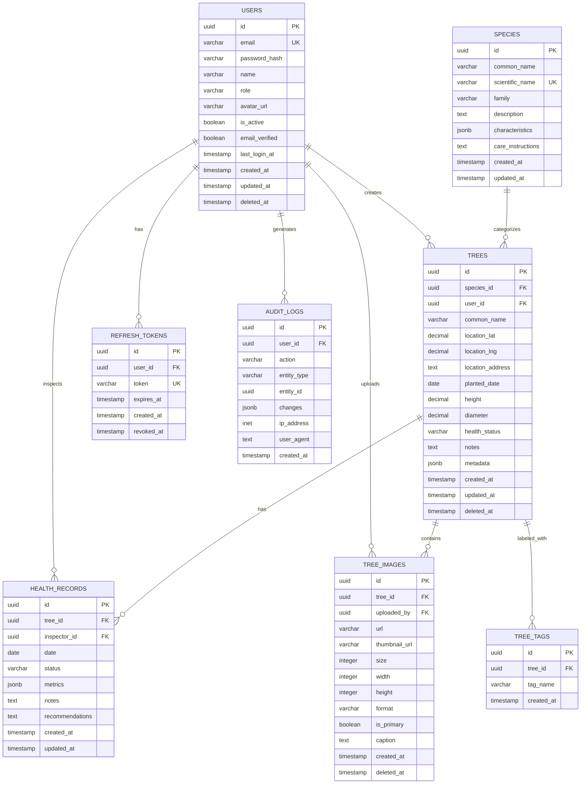

# Database Schema

## Table of Contents

- [Introduction](#introduction)
- [Database Selection](#database-selection)
- [Schema Design](#schema-design)
- [Entity Relationship Diagram](#entity-relationship-diagram)
- [Tables](#tables)
- [Indexes](#indexes)
- [Constraints](#constraints)
- [Migrations](#migrations)
- [Data Access Patterns](#data-access-patterns)

## Introduction

This document describes the database schema for TreeNetra, including table structures, relationships, and design decisions.

### Design Goals

- **Normalization**: Reduce data redundancy
- **Performance**: Optimize for common queries
- **Scalability**: Support growth
- **Integrity**: Maintain data consistency
- **Flexibility**: Easy to extend

## Database Selection

### Primary Database: PostgreSQL

**Reasons:**
- ACID compliance
- Advanced features (JSONB, full-text search, GIS)
- Strong community support
- Excellent performance
- Open source

**Version:** PostgreSQL 15+

### Secondary Stores

- **Redis**: Caching and sessions
- **Elasticsearch**: Full-text search
- **S3/Object Storage**: Images and files

## Schema Design

### Core Principles

1. **Third Normal Form (3NF)**: Eliminate data redundancy
2. **Foreign Keys**: Enforce referential integrity
3. **Indexes**: Optimize query performance
4. **Timestamps**: Track creation and updates
5. **Soft Deletes**: Preserve data history

## Entity Relationship Diagram



### Database Relationships Summary

| Parent Table | Child Table | Relationship | Cascade Rule | Description |
|--------------|-------------|--------------|--------------|-------------|
| users | trees | One-to-Many | RESTRICT | User owns multiple trees |
| users | health_records | One-to-Many | RESTRICT | User performs inspections |
| users | tree_images | One-to-Many | RESTRICT | User uploads images |
| users | refresh_tokens | One-to-Many | CASCADE | User has multiple tokens |
| users | audit_logs | One-to-Many | SET NULL | User generates audit logs |
| species | trees | One-to-Many | SET NULL | Species categorizes trees |
| trees | health_records | One-to-Many | CASCADE | Tree has health history |
| trees | tree_images | One-to-Many | CASCADE | Tree has multiple images |
| trees | tree_tags | One-to-Many | CASCADE | Tree has multiple tags |

## Tables

### users

Stores user account information.

```sql
CREATE TABLE users (
    id UUID PRIMARY KEY DEFAULT gen_random_uuid(),
    email VARCHAR(255) UNIQUE NOT NULL,
    password_hash VARCHAR(255) NOT NULL,
    name VARCHAR(255) NOT NULL,
    role VARCHAR(50) NOT NULL DEFAULT 'user',
    avatar_url VARCHAR(500),
    is_active BOOLEAN DEFAULT true,
    email_verified BOOLEAN DEFAULT false,
    last_login_at TIMESTAMP WITH TIME ZONE,
    created_at TIMESTAMP WITH TIME ZONE DEFAULT CURRENT_TIMESTAMP,
    updated_at TIMESTAMP WITH TIME ZONE DEFAULT CURRENT_TIMESTAMP,
    deleted_at TIMESTAMP WITH TIME ZONE,
    
    CONSTRAINT users_role_check CHECK (role IN ('admin', 'manager', 'user', 'viewer'))
);

CREATE INDEX idx_users_email ON users(email) WHERE deleted_at IS NULL;
CREATE INDEX idx_users_role ON users(role) WHERE deleted_at IS NULL;
```

### species

Reference table for tree species information.

```sql
CREATE TABLE species (
    id UUID PRIMARY KEY DEFAULT gen_random_uuid(),
    common_name VARCHAR(255) NOT NULL,
    scientific_name VARCHAR(255) NOT NULL UNIQUE,
    family VARCHAR(255),
    description TEXT,
    characteristics JSONB,
    care_instructions TEXT,
    created_at TIMESTAMP WITH TIME ZONE DEFAULT CURRENT_TIMESTAMP,
    updated_at TIMESTAMP WITH TIME ZONE DEFAULT CURRENT_TIMESTAMP
);

CREATE INDEX idx_species_common_name ON species(common_name);
CREATE INDEX idx_species_scientific_name ON species(scientific_name);
```

### trees

Main table storing tree records.

```sql
CREATE TABLE trees (
    id UUID PRIMARY KEY DEFAULT gen_random_uuid(),
    species_id UUID REFERENCES species(id),
    user_id UUID NOT NULL REFERENCES users(id),
    common_name VARCHAR(255),
    
    -- Location data
    location_lat DECIMAL(10, 8),
    location_lng DECIMAL(11, 8),
    location_address TEXT,
    
    -- Tree measurements
    planted_date DATE,
    height DECIMAL(10, 2), -- in meters
    diameter DECIMAL(10, 2), -- in centimeters (DBH)
    
    -- Health status
    health_status VARCHAR(50) DEFAULT 'healthy',
    
    -- Additional data
    notes TEXT,
    metadata JSONB,
    
    -- Timestamps
    created_at TIMESTAMP WITH TIME ZONE DEFAULT CURRENT_TIMESTAMP,
    updated_at TIMESTAMP WITH TIME ZONE DEFAULT CURRENT_TIMESTAMP,
    deleted_at TIMESTAMP WITH TIME ZONE,
    
    CONSTRAINT trees_health_status_check CHECK (
        health_status IN ('healthy', 'needs_attention', 'critical', 'dead')
    )
);

-- Indexes
CREATE INDEX idx_trees_species_id ON trees(species_id) WHERE deleted_at IS NULL;
CREATE INDEX idx_trees_user_id ON trees(user_id) WHERE deleted_at IS NULL;
CREATE INDEX idx_trees_health_status ON trees(health_status) WHERE deleted_at IS NULL;
CREATE INDEX idx_trees_location ON trees USING GIST (
    ll_to_earth(location_lat, location_lng)
) WHERE deleted_at IS NULL;
CREATE INDEX idx_trees_planted_date ON trees(planted_date) WHERE deleted_at IS NULL;
CREATE INDEX idx_trees_created_at ON trees(created_at DESC) WHERE deleted_at IS NULL;

-- Full-text search
CREATE INDEX idx_trees_search ON trees USING GIN (
    to_tsvector('english', 
        COALESCE(common_name, '') || ' ' || 
        COALESCE(location_address, '') || ' ' || 
        COALESCE(notes, '')
    )
) WHERE deleted_at IS NULL;
```

### health_records

Tracks tree health over time.

```sql
CREATE TABLE health_records (
    id UUID PRIMARY KEY DEFAULT gen_random_uuid(),
    tree_id UUID NOT NULL REFERENCES trees(id) ON DELETE CASCADE,
    inspector_id UUID NOT NULL REFERENCES users(id),
    
    date DATE NOT NULL,
    status VARCHAR(50) NOT NULL,
    
    -- Health metrics stored as JSONB for flexibility
    metrics JSONB,
    /* Example metrics:
    {
        "leafDensity": 85,
        "diseaseIndicators": 0,
        "pestActivity": 1,
        "structuralIntegrity": 95,
        "growthRate": 0.5
    }
    */
    
    notes TEXT,
    recommendations TEXT,
    
    created_at TIMESTAMP WITH TIME ZONE DEFAULT CURRENT_TIMESTAMP,
    updated_at TIMESTAMP WITH TIME ZONE DEFAULT CURRENT_TIMESTAMP,
    
    CONSTRAINT health_records_status_check CHECK (
        status IN ('healthy', 'needs_attention', 'critical', 'dead')
    )
);

CREATE INDEX idx_health_records_tree_id ON health_records(tree_id);
CREATE INDEX idx_health_records_inspector_id ON health_records(inspector_id);
CREATE INDEX idx_health_records_date ON health_records(date DESC);
CREATE INDEX idx_health_records_status ON health_records(status);
CREATE INDEX idx_health_records_metrics ON health_records USING GIN (metrics);
```

### tree_images

Stores references to tree images.

```sql
CREATE TABLE tree_images (
    id UUID PRIMARY KEY DEFAULT gen_random_uuid(),
    tree_id UUID NOT NULL REFERENCES trees(id) ON DELETE CASCADE,
    uploaded_by UUID NOT NULL REFERENCES users(id),
    
    url VARCHAR(500) NOT NULL,
    thumbnail_url VARCHAR(500),
    
    -- Image metadata
    size INTEGER, -- in bytes
    width INTEGER,
    height INTEGER,
    format VARCHAR(10),
    
    is_primary BOOLEAN DEFAULT false,
    caption TEXT,
    
    created_at TIMESTAMP WITH TIME ZONE DEFAULT CURRENT_TIMESTAMP,
    deleted_at TIMESTAMP WITH TIME ZONE
);

CREATE INDEX idx_tree_images_tree_id ON tree_images(tree_id) WHERE deleted_at IS NULL;
CREATE INDEX idx_tree_images_uploaded_by ON tree_images(uploaded_by);
CREATE INDEX idx_tree_images_is_primary ON tree_images(tree_id, is_primary) 
    WHERE is_primary = true AND deleted_at IS NULL;
```

### tree_tags

Flexible tagging system for trees.

```sql
CREATE TABLE tree_tags (
    id UUID PRIMARY KEY DEFAULT gen_random_uuid(),
    tree_id UUID NOT NULL REFERENCES trees(id) ON DELETE CASCADE,
    tag_name VARCHAR(100) NOT NULL,
    created_at TIMESTAMP WITH TIME ZONE DEFAULT CURRENT_TIMESTAMP,
    
    UNIQUE(tree_id, tag_name)
);

CREATE INDEX idx_tree_tags_tree_id ON tree_tags(tree_id);
CREATE INDEX idx_tree_tags_tag_name ON tree_tags(tag_name);
```

### refresh_tokens

Stores refresh tokens for authentication.

```sql
CREATE TABLE refresh_tokens (
    id UUID PRIMARY KEY DEFAULT gen_random_uuid(),
    user_id UUID NOT NULL REFERENCES users(id) ON DELETE CASCADE,
    token VARCHAR(500) UNIQUE NOT NULL,
    expires_at TIMESTAMP WITH TIME ZONE NOT NULL,
    created_at TIMESTAMP WITH TIME ZONE DEFAULT CURRENT_TIMESTAMP,
    revoked_at TIMESTAMP WITH TIME ZONE
);

CREATE INDEX idx_refresh_tokens_user_id ON refresh_tokens(user_id);
CREATE INDEX idx_refresh_tokens_token ON refresh_tokens(token) WHERE revoked_at IS NULL;
CREATE INDEX idx_refresh_tokens_expires_at ON refresh_tokens(expires_at);
```

### audit_logs

Tracks all important actions for auditing.

```sql
CREATE TABLE audit_logs (
    id UUID PRIMARY KEY DEFAULT gen_random_uuid(),
    user_id UUID REFERENCES users(id),
    
    action VARCHAR(100) NOT NULL,
    entity_type VARCHAR(100) NOT NULL,
    entity_id UUID,
    
    changes JSONB,
    /* Example:
    {
        "before": {"height": 15.5},
        "after": {"height": 16.0}
    }
    */
    
    ip_address INET,
    user_agent TEXT,
    
    created_at TIMESTAMP WITH TIME ZONE DEFAULT CURRENT_TIMESTAMP
);

CREATE INDEX idx_audit_logs_user_id ON audit_logs(user_id);
CREATE INDEX idx_audit_logs_entity ON audit_logs(entity_type, entity_id);
CREATE INDEX idx_audit_logs_action ON audit_logs(action);
CREATE INDEX idx_audit_logs_created_at ON audit_logs(created_at DESC);
```

## Indexes

### Index Strategy

1. **Primary Keys**: Automatically indexed (UUID)
2. **Foreign Keys**: Indexed for join performance
3. **Query Filters**: Index frequently filtered columns
4. **Sorting**: Index columns used in ORDER BY
5. **Composite Indexes**: For multi-column queries
6. **Partial Indexes**: For soft deletes (WHERE deleted_at IS NULL)

### Geospatial Indexes

Using PostGIS extension for location-based queries:

```sql
-- Enable PostGIS
CREATE EXTENSION IF NOT EXISTS postgis;
CREATE EXTENSION IF NOT EXISTS earthdistance CASCADE;

-- Geospatial index for proximity searches
CREATE INDEX idx_trees_geom ON trees USING GIST (
    ST_MakePoint(location_lng, location_lat)::geography
) WHERE deleted_at IS NULL;
```

## Constraints

### Foreign Key Constraints

```sql
-- Cascade deletes for dependent records
ALTER TABLE health_records 
    ADD CONSTRAINT fk_health_records_tree 
    FOREIGN KEY (tree_id) REFERENCES trees(id) ON DELETE CASCADE;

ALTER TABLE tree_images 
    ADD CONSTRAINT fk_tree_images_tree 
    FOREIGN KEY (tree_id) REFERENCES trees(id) ON DELETE CASCADE;

-- Restrict deletes for referenced records
ALTER TABLE trees 
    ADD CONSTRAINT fk_trees_user 
    FOREIGN KEY (user_id) REFERENCES users(id) ON DELETE RESTRICT;
```

### Check Constraints

```sql
-- Ensure valid coordinates
ALTER TABLE trees ADD CONSTRAINT trees_location_lat_check 
    CHECK (location_lat BETWEEN -90 AND 90);

ALTER TABLE trees ADD CONSTRAINT trees_location_lng_check 
    CHECK (location_lng BETWEEN -180 AND 180);

-- Ensure positive measurements
ALTER TABLE trees ADD CONSTRAINT trees_height_check 
    CHECK (height IS NULL OR height > 0);

ALTER TABLE trees ADD CONSTRAINT trees_diameter_check 
    CHECK (diameter IS NULL OR diameter > 0);
```

## Migrations

### Migration Tool: Prisma Migrate

```prisma
// prisma/schema.prisma
generator client {
  provider = "prisma-client-js"
}

datasource db {
  provider = "postgresql"
  url      = env("DATABASE_URL")
}

model User {
  id            String    @id @default(uuid())
  email         String    @unique
  passwordHash  String    @map("password_hash")
  name          String
  role          String    @default("user")
  isActive      Boolean   @default(true) @map("is_active")
  createdAt     DateTime  @default(now()) @map("created_at")
  updatedAt     DateTime  @updatedAt @map("updated_at")
  deletedAt     DateTime? @map("deleted_at")
  
  trees         Tree[]
  healthRecords HealthRecord[]
  
  @@map("users")
}

model Tree {
  id            String    @id @default(uuid())
  speciesId     String?   @map("species_id")
  userId        String    @map("user_id")
  commonName    String?   @map("common_name")
  locationLat   Decimal?  @map("location_lat")
  locationLng   Decimal?  @map("location_lng")
  plantedDate   DateTime? @map("planted_date")
  height        Decimal?
  diameter      Decimal?
  healthStatus  String    @default("healthy") @map("health_status")
  createdAt     DateTime  @default(now()) @map("created_at")
  updatedAt     DateTime  @updatedAt @map("updated_at")
  deletedAt     DateTime? @map("deleted_at")
  
  user          User      @relation(fields: [userId], references: [id])
  healthRecords HealthRecord[]
  images        TreeImage[]
  tags          TreeTag[]
  
  @@map("trees")
}
```

### Migration Commands

```bash
# Create new migration
npx prisma migrate dev --name add_trees_table

# Apply migrations
npx prisma migrate deploy

# Reset database (dev only)
npx prisma migrate reset

# View migration status
npx prisma migrate status
```

## Data Access Patterns

### Common Queries

#### 1. Get Trees with Health Records

```sql
SELECT 
    t.*,
    json_agg(
        json_build_object(
            'id', hr.id,
            'date', hr.date,
            'status', hr.status,
            'metrics', hr.metrics
        ) ORDER BY hr.date DESC
    ) FILTER (WHERE hr.id IS NOT NULL) as health_records
FROM trees t
LEFT JOIN health_records hr ON hr.tree_id = t.id
WHERE t.deleted_at IS NULL
GROUP BY t.id;
```

#### 2. Find Trees Near Location

```sql
SELECT 
    t.*,
    earth_distance(
        ll_to_earth(t.location_lat, t.location_lng),
        ll_to_earth(40.7128, -74.0060)
    ) as distance_meters
FROM trees t
WHERE t.deleted_at IS NULL
  AND earth_box(ll_to_earth(40.7128, -74.0060), 5000) @> 
      ll_to_earth(t.location_lat, t.location_lng)
ORDER BY distance_meters
LIMIT 20;
```

#### 3. Full-Text Search

```sql
SELECT t.*, ts_rank(search_vector, query) as rank
FROM trees t,
     to_tsquery('english', 'oak & park') query
WHERE t.deleted_at IS NULL
  AND to_tsvector('english', 
        COALESCE(t.common_name, '') || ' ' || 
        COALESCE(t.location_address, '')
      ) @@ query
ORDER BY rank DESC
LIMIT 20;
```

#### 4. Health Trends Over Time

```sql
SELECT 
    date_trunc('month', date) as month,
    status,
    COUNT(*) as count
FROM health_records
WHERE date >= CURRENT_DATE - INTERVAL '12 months'
GROUP BY date_trunc('month', date), status
ORDER BY month, status;
```

---

**Document Version**: 1.0  
**Last Updated**: November 22, 2025  
**Author**: TreeNetra Team
