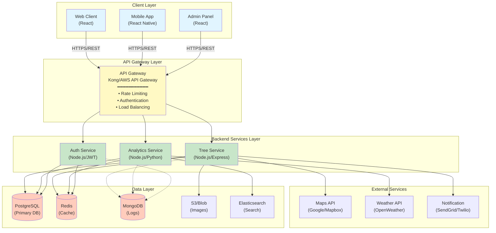
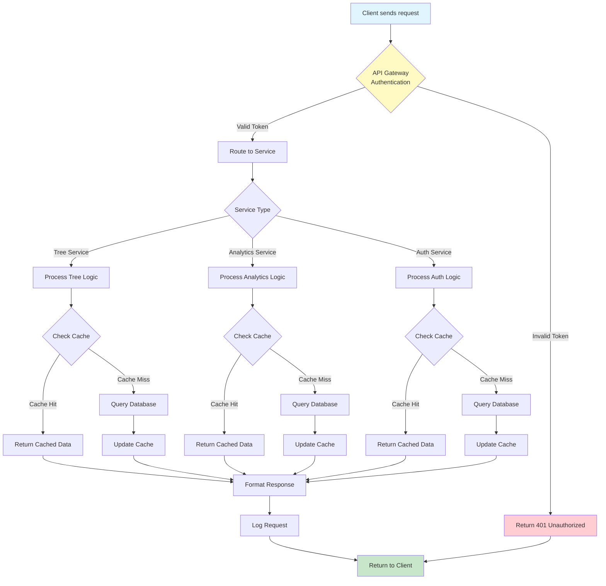

# TreeNetra Architecture Overview

## Table of Contents

- [Introduction](#introduction)
- [System Architecture](#system-architecture)
- [High-Level Design](#high-level-design)
- [Technology Stack](#technology-stack)
- [Core Components](#core-components)
- [Data Flow](#data-flow)
- [Scalability](#scalability)
- [Related Documents](#related-documents)

## Introduction

TreeNetra is a comprehensive tree management and monitoring platform designed to provide real-time insights into tree inventory, health monitoring, and environmental impact tracking. This document provides an overview of the system architecture and design principles.

### Purpose

This architecture documentation aims to:
- Provide a clear understanding of system components and their interactions
- Guide development and deployment decisions
- Facilitate onboarding of new team members
- Support system maintenance and evolution

### Scope

This document covers:
- Overall system architecture
- Component interactions
- Technology choices
- Scalability considerations
- Security architecture

## System Architecture

### Architecture Style

TreeNetra follows a **microservices-oriented architecture** with the following characteristics:

- **Separation of Concerns**: Clear boundaries between services
- **Loose Coupling**: Services communicate via well-defined APIs
- **Independent Deployment**: Services can be deployed independently
- **Technology Diversity**: Different services can use different technologies
- **Resilience**: Failure in one service doesn't cascade to others

### Architecture Diagram



## High-Level Design

### Layered Architecture

#### 1. Presentation Layer
- **Web Application**: React-based SPA for desktop users
- **Mobile Application**: React Native apps for iOS and Android
- **Admin Dashboard**: Management interface for administrators

#### 2. API Gateway Layer
- **Traffic Management**: Rate limiting, throttling
- **Security**: Authentication, authorization, SSL termination
- **Routing**: Request routing to appropriate services
- **Monitoring**: Request logging and metrics collection

#### 3. Application Layer
- **Business Logic**: Core application functionality
- **Service Orchestration**: Coordination between services
- **Data Processing**: Transform and validate data
- **Integration**: Connect with external services

#### 4. Data Layer
- **Relational Database**: PostgreSQL for structured data
- **Cache**: Redis for session and frequently accessed data
- **Document Store**: MongoDB for logs and unstructured data
- **Object Storage**: S3 for images and files
- **Search Engine**: Elasticsearch for full-text search

## Technology Stack

### Frontend
```yaml
Web:
  - Framework: React 18+
  - State Management: Redux Toolkit / Zustand
  - UI Library: Material-UI / Tailwind CSS
  - Build Tool: Vite
  - Testing: Jest, React Testing Library

Mobile:
  - Framework: React Native
  - Navigation: React Navigation
  - State: Redux Toolkit
  - Maps: react-native-maps
```

### Backend
```yaml
API:
  - Runtime: Node.js 18+
  - Framework: Express.js
  - Authentication: JWT, OAuth 2.0
  - Validation: Joi / Zod
  - Documentation: Swagger/OpenAPI

Services:
  - Tree Service: Node.js + Express
  - Analytics: Python + FastAPI
  - Authentication: Node.js + Passport
```

### Database
```yaml
Primary:
  - RDBMS: PostgreSQL 15+
  - ORM: Prisma / TypeORM
  - Migrations: Prisma Migrate

Cache:
  - In-Memory: Redis 7+
  - Use Cases: Sessions, rate limiting, caching

Search:
  - Engine: Elasticsearch 8+
  - Use Cases: Full-text search, logs
```

### Infrastructure
```yaml
Containerization:
  - Docker
  - Docker Compose

Orchestration:
  - Kubernetes
  - Helm Charts

CI/CD:
  - GitHub Actions
  - Jenkins

Monitoring:
  - Application: New Relic / Datadog
  - Infrastructure: Prometheus + Grafana
  - Logging: ELK Stack
```

## Core Components

### 1. Tree Management Service

**Responsibilities:**
- CRUD operations for tree records
- Tree categorization and tagging
- Location management
- Image upload and storage

**Technologies:**
- Node.js + Express
- PostgreSQL
- S3 for images

**APIs:**
- `GET /api/trees` - List trees
- `POST /api/trees` - Create tree
- `GET /api/trees/:id` - Get tree details
- `PUT /api/trees/:id` - Update tree
- `DELETE /api/trees/:id` - Delete tree

### 2. Health Monitoring Service

**Responsibilities:**
- Track tree health metrics
- Disease detection and alerts
- Growth pattern analysis
- Health history tracking

**Technologies:**
- Node.js + Express
- PostgreSQL
- Redis for caching
- ML models for disease detection

### 3. Analytics Service

**Responsibilities:**
- Generate reports and insights
- Statistical analysis
- Trend detection
- Data visualization

**Technologies:**
- Python + FastAPI
- PostgreSQL
- Pandas, NumPy
- Matplotlib, Plotly

### 4. Authentication & Authorization Service

**Responsibilities:**
- User authentication
- Token management
- Role-based access control
- Session management

**Technologies:**
- Node.js + Passport
- JWT tokens
- Redis for sessions
- OAuth 2.0 integration

### 5. Notification Service

**Responsibilities:**
- Email notifications
- SMS alerts
- Push notifications
- In-app messages

**Technologies:**
- Node.js + Bull (job queue)
- SendGrid (email)
- Twilio (SMS)
- Firebase (push notifications)

### 6. Search Service

**Responsibilities:**
- Full-text search
- Faceted search
- Autocomplete
- Search analytics

**Technologies:**
- Elasticsearch
- Node.js client
- Redis for caching

## Data Flow

### User Request Flow



### Data Write Flow

```
1. Client submits data
   ↓
2. Validation at API Gateway
   ↓
3. Service validates business rules
   ↓
4. Transaction begins
   ↓
5. Write to primary database
   ↓
6. Invalidate cache
   ↓
7. Emit event for async processing
   ↓
8. Transaction commits
   ↓
9. Return success response
```

### Real-time Update Flow

```
1. Database change occurs
   ↓
2. Trigger/webhook activated
   ↓
3. Event published to message queue
   ↓
4. Subscriber services notified
   ↓
5. WebSocket pushes to connected clients
   ↓
6. Client UI updates in real-time
```

## Scalability

### Horizontal Scaling

- **Stateless Services**: Services designed to be stateless
- **Load Balancing**: Distribute traffic across instances
- **Auto-scaling**: Scale based on metrics (CPU, memory, requests)
- **Database Replication**: Read replicas for read-heavy workloads

### Caching Strategy

```
┌──────────────┐
│   Client     │
└──────┬───────┘
       │
       ▼
┌──────────────┐
│ CDN (Static) │ ← Cache static assets
└──────┬───────┘
       │
       ▼
┌──────────────┐
│ API Gateway  │
└──────┬───────┘
       │
       ▼
┌──────────────┐
│ Redis Cache  │ ← Cache API responses
└──────┬───────┘
       │
       ▼
┌──────────────┐
│  Database    │
└──────────────┘
```

### Performance Optimization

1. **Database Optimization**
   - Proper indexing
   - Query optimization
   - Connection pooling
   - Read replicas

2. **Caching Layers**
   - CDN for static content
   - Redis for API responses
   - Browser caching
   - Application-level caching

3. **Asynchronous Processing**
   - Job queues for heavy tasks
   - Background workers
   - Event-driven architecture

4. **Content Delivery**
   - CDN for global distribution
   - Image optimization
   - Lazy loading
   - Code splitting

## Related Documents

- [System Design](system-design.md) - Detailed system design
- [API Architecture](api-architecture.md) - API design and specifications
- [Database Schema](database-schema.md) - Data model and relationships
- [Deployment Architecture](deployment-architecture.md) - Infrastructure and deployment
- [Security Architecture](security-architecture.md) - Security measures and best practices

---

**Document Version**: 1.0  
**Last Updated**: November 22, 2025  
**Author**: TreeNetra Team
