# Security Architecture

## Table of Contents

- [Introduction](#introduction)
- [Security Principles](#security-principles)
- [Authentication & Authorization](#authentication--authorization)
- [Data Security](#data-security)
- [Network Security](#network-security)
- [Application Security](#application-security)
- [Infrastructure Security](#infrastructure-security)
- [Compliance](#compliance)
- [Incident Response](#incident-response)

## Introduction

This document outlines the security architecture for TreeNetra, covering authentication, authorization, data protection, and compliance measures.

### Security Objectives

- **Confidentiality**: Protect sensitive data
- **Integrity**: Ensure data accuracy and consistency
- **Availability**: Maintain system accessibility
- **Accountability**: Track and audit all actions
- **Non-repudiation**: Prevent denial of actions

## Security Principles

### Defense in Depth

Multiple layers of security controls:

```mermaid
graph TD
    subgraph "Layer 1: User Authentication"
        L1["🔐 JWT Tokens<br/>🔐 OAuth 2.0<br/>🔐 MFA (TOTP)<br/>🔐 Password Policy"]
    end
    
    subgraph "Layer 2: Authorization"
        L2["🛡️ RBAC<br/>🛡️ Permission Checks<br/>🛡️ Resource Ownership<br/>🛡️ API Scopes"]
    end
    
    subgraph "Layer 3: Input Validation"
        L3["✅ Schema Validation<br/>✅ Sanitization<br/>✅ Type Checking<br/>✅ Length Limits"]
    end
    
    subgraph "Layer 4: Application Security"
        L4["🔒 HTTPS Only<br/>🔒 CSRF Tokens<br/>🔒 XSS Prevention<br/>🔒 SQL Injection Guard"]
    end
    
    subgraph "Layer 5: Network Security"
        L5["🌐 VPC Isolation<br/>🌐 Security Groups<br/>🌐 WAF Rules<br/>🌐 DDoS Protection"]
    end
    
    subgraph "Layer 6: Infrastructure"
        L6["🏗️ Encrypted Storage<br/>🏗️ Secrets Manager<br/>🏗️ IAM Roles<br/>🏗️ Container Security"]
    end
    
    subgraph "Layer 7: Data Protection"
        L7["🔐 AES-256 Encryption<br/>🔐 TLS 1.3<br/>🔐 Key Rotation<br/>🔐 Data Masking"]
    end
    
    L1 --> L2
    L2 --> L3
    L3 --> L4
    L4 --> L5
    L5 --> L6
    L6 --> L7
    
    style L1 fill:#ffebee
    style L2 fill:#fce4ec
    style L3 fill:#f3e5f5
    style L4 fill:#ede7f6
    style L5 fill:#e8eaf6
    style L6 fill:#e3f2fd
    style L7 fill:#e1f5fe
```



### Threat Model & Mitigation Strategy

| Threat Category | Threat | Risk Level | Mitigation | Status |
|----------------|--------|------------|------------|--------|
| **Authentication** | Brute Force Attack | 🔴 High | Rate limiting, Account lockout, MFA | ✅ Implemented |
| **Authentication** | Credential Stuffing | 🔴 High | MFA, CAPTCHA, Anomaly detection | ✅ Implemented |
| **Authentication** | Session Hijacking | 🟡 Medium | Secure cookies, Token rotation | ✅ Implemented |
| **Authorization** | Privilege Escalation | 🔴 High | RBAC, Permission checks, Audit logs | ✅ Implemented |
| **Authorization** | Insecure Direct Object Reference | 🟡 Medium | Ownership validation, UUID usage | ✅ Implemented |
| **Injection** | SQL Injection | 🔴 High | Parameterized queries, ORM, WAF | ✅ Implemented |
| **Injection** | NoSQL Injection | 🟡 Medium | Input validation, Query sanitization | ✅ Implemented |
| **Injection** | Command Injection | 🔴 High | Input validation, Avoid shell exec | ✅ Implemented |
| **XSS** | Stored XSS | 🔴 High | Output encoding, CSP headers | ✅ Implemented |
| **XSS** | Reflected XSS | 🟡 Medium | Input sanitization, CSP | ✅ Implemented |
| **CSRF** | Cross-Site Request Forgery | 🟡 Medium | CSRF tokens, SameSite cookies | ✅ Implemented |
| **Data** | Data Breach | 🔴 High | Encryption, Access controls, Monitoring | ✅ Implemented |
| **Data** | Data Leakage | 🟡 Medium | Data masking, Audit logs, DLP | ✅ Implemented |
| **DDoS** | Application Layer DDoS | 🔴 High | Rate limiting, WAF, Auto-scaling | ✅ Implemented |
| **DDoS** | Network Layer DDoS | 🔴 High | AWS Shield, CloudFront | ✅ Implemented |
| **API** | API Abuse | 🟡 Medium | Rate limiting, API keys, Monitoring | ✅ Implemented |
| **API** | Broken Authentication | 🔴 High | JWT validation, Token expiry | ✅ Implemented |
| **Supply Chain** | Vulnerable Dependencies | 🟡 Medium | npm audit, Snyk, Dependabot | ✅ Implemented |
| **Supply Chain** | Malicious Packages | 🟡 Medium | Package verification, Lock files | ✅ Implemented |
| **Infrastructure** | Container Escape | 🟡 Medium | Security context, Read-only FS | ✅ Implemented |
| **Infrastructure** | Misconfigured S3 | 🔴 High | Bucket policies, Encryption | ✅ Implemented |

### Least Privilege Principle

- Grant minimum necessary permissions
- Regular access reviews
- Time-bound elevated privileges
- Separate admin and user accounts

### Zero Trust Architecture

- Never trust, always verify
- Assume breach mentality
- Verify explicitly
- Least privilege access
- Continuous monitoring

## Authentication & Authorization

### Authentication Flow

```
┌──────────┐      ┌──────────┐      ┌──────────┐
│  Client  │─────▶│   API    │─────▶│   Auth   │
│          │ POST  │ Gateway  │      │ Service  │
└──────────┘ /auth └──────────┘      └──────────┘
                                           │
                                           ▼
                                    ┌──────────┐
                                    │   User   │
                                    │    DB    │
                                    └──────────┘
                                           │
                                           ▼
                                    Generate Tokens
                                           │
                                           ▼
                                    ┌──────────┐
                                    │  Redis   │
                                    │  Store   │
                                    └──────────┘
```

### JWT Token Security

```javascript
// Token Generation
const accessToken = jwt.sign(
  {
    userId: user.id,
    email: user.email,
    role: user.role,
    permissions: user.permissions
  },
  process.env.JWT_SECRET,
  {
    algorithm: 'HS256',
    expiresIn: '1h',
    issuer: 'treenetra-api',
    audience: 'treenetra-client'
  }
);

// Token Verification
const verifyToken = (token) => {
  try {
    const decoded = jwt.verify(token, process.env.JWT_SECRET, {
      algorithms: ['HS256'],
      issuer: 'treenetra-api',
      audience: 'treenetra-client'
    });
    
    // Check if token is blacklisted
    const isBlacklisted = await redis.get(`blacklist:${token}`);
    if (isBlacklisted) {
      throw new Error('Token has been revoked');
    }
    
    return decoded;
  } catch (error) {
    throw new AuthenticationError('Invalid token');
  }
};
```

### Password Security

```javascript
// Password Hashing with bcrypt
const hashPassword = async (password) => {
  const saltRounds = 12;
  return await bcrypt.hash(password, saltRounds);
};

// Password Verification
const verifyPassword = async (password, hash) => {
  return await bcrypt.compare(password, hash);
};

// Password Requirements
const passwordPolicy = {
  minLength: 8,
  maxLength: 128,
  requireUppercase: true,
  requireLowercase: true,
  requireNumbers: true,
  requireSpecialChars: true,
  preventCommonPasswords: true,
  preventUserInfo: true, // email, name, etc.
  expiryDays: 90,
  historyCount: 5 // prevent reusing last 5 passwords
};
```

### Multi-Factor Authentication (MFA)

```javascript
// TOTP Setup
const setupMFA = async (userId) => {
  const secret = speakeasy.generateSecret({
    name: `TreeNetra (${user.email})`,
    issuer: 'TreeNetra'
  });
  
  // Store secret encrypted
  await storeEncrypted(userId, 'mfa_secret', secret.base32);
  
  // Generate QR code
  const qrCode = await QRCode.toDataURL(secret.otpauth_url);
  
  return { qrCode, backupCodes: generateBackupCodes() };
};

// TOTP Verification
const verifyMFA = async (userId, token) => {
  const secret = await getDecrypted(userId, 'mfa_secret');
  
  return speakeasy.totp.verify({
    secret,
    encoding: 'base32',
    token,
    window: 1 // Allow 1 step window
  });
};
```

### Role-Based Access Control (RBAC)

```javascript
// Permission System
const permissions = {
  // Trees
  'trees:read': ['admin', 'manager', 'user', 'viewer'],
  'trees:create': ['admin', 'manager', 'user'],
  'trees:update': ['admin', 'manager', 'user'],
  'trees:delete': ['admin', 'manager'],
  
  // Users
  'users:read': ['admin', 'manager'],
  'users:create': ['admin'],
  'users:update': ['admin'],
  'users:delete': ['admin'],
  
  // Analytics
  'analytics:read': ['admin', 'manager', 'viewer'],
  'analytics:export': ['admin', 'manager']
};

// Middleware
const requirePermission = (permission) => {
  return async (req, res, next) => {
    const user = req.user;
    
    if (!user) {
      return res.status(401).json({
        success: false,
        error: { code: 'UNAUTHORIZED', message: 'Authentication required' }
      });
    }
    
    const allowedRoles = permissions[permission] || [];
    if (!allowedRoles.includes(user.role)) {
      return res.status(403).json({
        success: false,
        error: { 
          code: 'FORBIDDEN', 
          message: 'Insufficient permissions' 
        }
      });
    }
    
    next();
  };
};

// Usage
app.delete('/api/trees/:id', 
  authenticate,
  requirePermission('trees:delete'),
  treeController.deleteTree
);
```

## Data Security

### Encryption

#### Data at Rest

```javascript
// Database Encryption
// - Enable RDS encryption with AWS KMS
// - Encrypt sensitive fields with field-level encryption

const encryptField = async (data, key) => {
  const cipher = crypto.createCipheriv('aes-256-gcm', key, iv);
  let encrypted = cipher.update(data, 'utf8', 'hex');
  encrypted += cipher.final('hex');
  const authTag = cipher.getAuthTag();
  
  return {
    encrypted,
    authTag: authTag.toString('hex'),
    iv: iv.toString('hex')
  };
};

// Sensitive fields to encrypt
const sensitiveFields = [
  'email',
  'phone',
  'address',
  'paymentInfo'
];
```

#### Data in Transit

```yaml
TLS Configuration:
  Version: TLS 1.3
  Cipher Suites:
    - TLS_AES_256_GCM_SHA384
    - TLS_CHACHA20_POLY1305_SHA256
    - TLS_AES_128_GCM_SHA256
  Certificate: AWS Certificate Manager
  HSTS: Enabled
  Perfect Forward Secrecy: Enabled
```

### Data Masking

```javascript
// Mask sensitive data in logs and responses
const maskEmail = (email) => {
  const [name, domain] = email.split('@');
  return `${name.substring(0, 2)}***@${domain}`;
};

const maskPhone = (phone) => {
  return phone.replace(/\d(?=\d{4})/g, '*');
};

// Sanitize user data
const sanitizeUser = (user) => {
  const { passwordHash, mfaSecret, ...safeUser } = user;
  return {
    ...safeUser,
    email: maskEmail(safeUser.email),
    phone: safeUser.phone ? maskPhone(safeUser.phone) : null
  };
};
```

### Data Retention

```yaml
Retention Policies:
  User Data:
    Active users: Indefinite
    Deleted accounts: 30 days
  Audit Logs: 2 years
  Access Logs: 90 days
  Error Logs: 30 days
  Backups: 30 days
  
Deletion Process:
  1. Soft delete (mark as deleted)
  2. 30-day grace period
  3. Hard delete (permanent removal)
  4. Audit log entry
```

## Network Security

### VPC Architecture

```
┌─────────────────────────────────────────────────────────┐
│                         VPC                             │
│                   10.0.0.0/16                          │
│                                                         │
│  ┌───────────────────────────────────────────────────┐ │
│  │            Public Subnets                         │ │
│  │  ┌─────────────┐       ┌─────────────┐          │ │
│  │  │ us-east-1a  │       │ us-east-1b  │          │ │
│  │  │ 10.0.1.0/24 │       │ 10.0.2.0/24 │          │ │
│  │  │             │       │             │          │ │
│  │  │ - ALB       │       │ - ALB       │          │ │
│  │  │ - NAT GW    │       │ - NAT GW    │          │ │
│  │  └─────────────┘       └─────────────┘          │ │
│  └───────────────────────────────────────────────────┘ │
│                                                         │
│  ┌───────────────────────────────────────────────────┐ │
│  │           Private Subnets (App)                   │ │
│  │  ┌─────────────┐       ┌─────────────┐          │ │
│  │  │ us-east-1a  │       │ us-east-1b  │          │ │
│  │  │ 10.0.11.0/24│       │ 10.0.12.0/24│          │ │
│  │  │             │       │             │          │ │
│  │  │ - ECS Tasks │       │ - ECS Tasks │          │ │
│  │  │ - Lambda    │       │ - Lambda    │          │ │
│  │  └─────────────┘       └─────────────┘          │ │
│  └───────────────────────────────────────────────────┘ │
│                                                         │
│  ┌───────────────────────────────────────────────────┐ │
│  │           Private Subnets (Data)                  │ │
│  │  ┌─────────────┐       ┌─────────────┐          │ │
│  │  │ us-east-1a  │       │ us-east-1b  │          │ │
│  │  │ 10.0.21.0/24│       │ 10.0.22.0/24│          │ │
│  │  │             │       │             │          │ │
│  │  │ - RDS       │       │ - RDS       │          │ │
│  │  │ - Redis     │       │ - Redis     │          │ │
│  │  └─────────────┘       └─────────────┘          │ │
│  └───────────────────────────────────────────────────┘ │
└─────────────────────────────────────────────────────────┘
```

### Security Groups

```yaml
ALB Security Group:
  Inbound:
    - Port 80 (HTTP): 0.0.0.0/0 → Redirect to 443
    - Port 443 (HTTPS): 0.0.0.0/0
  Outbound:
    - All traffic: ECS Security Group

ECS Security Group:
  Inbound:
    - Port 3000: ALB Security Group
  Outbound:
    - Port 5432: RDS Security Group
    - Port 6379: Redis Security Group
    - Port 443: 0.0.0.0/0 (External APIs)

RDS Security Group:
  Inbound:
    - Port 5432: ECS Security Group
  Outbound:
    - None

Redis Security Group:
  Inbound:
    - Port 6379: ECS Security Group
  Outbound:
    - None
```

### WAF (Web Application Firewall)

```yaml
AWS WAF Rules:
  - Rate Limiting: 2000 requests per 5 minutes per IP
  - SQL Injection Protection
  - XSS Protection
  - Geo-blocking: Block known malicious regions
  - IP Reputation: Block known bad actors
  - Size Restrictions: Max 8KB request body
```

## Application Security

### Input Validation

```javascript
// Request validation with Joi
const treeSchema = Joi.object({
  species: Joi.string().max(255).required(),
  commonName: Joi.string().max(255).required(),
  location: Joi.object({
    lat: Joi.number().min(-90).max(90).required(),
    lng: Joi.number().min(-180).max(180).required(),
    address: Joi.string().max(500)
  }).required(),
  height: Joi.number().positive().max(200),
  diameter: Joi.number().positive().max(50),
  tags: Joi.array().items(Joi.string().max(100)).max(20)
});

// Middleware
const validateRequest = (schema) => {
  return (req, res, next) => {
    const { error, value } = schema.validate(req.body, {
      abortEarly: false,
      stripUnknown: true
    });
    
    if (error) {
      return res.status(400).json({
        success: false,
        error: {
          code: 'VALIDATION_ERROR',
          message: 'Validation failed',
          details: error.details.map(d => ({
            field: d.path.join('.'),
            message: d.message
          }))
        }
      });
    }
    
    req.validatedBody = value;
    next();
  };
};
```

### SQL Injection Prevention

```javascript
// Use parameterized queries
const getTreeById = async (id) => {
  // Bad: String concatenation
  // const query = `SELECT * FROM trees WHERE id = '${id}'`;
  
  // Good: Parameterized query
  const query = 'SELECT * FROM trees WHERE id = $1';
  const result = await db.query(query, [id]);
  return result.rows[0];
};

// Use ORM for complex queries
const trees = await prisma.tree.findMany({
  where: {
    healthStatus: 'critical',
    deletedAt: null
  },
  include: {
    healthRecords: true
  }
});
```

### XSS Prevention

```javascript
// Sanitize user input
const sanitizeHtml = require('sanitize-html');

const sanitizeInput = (input) => {
  return sanitizeHtml(input, {
    allowedTags: [], // No HTML tags allowed
    allowedAttributes: {}
  });
};

// Set security headers
app.use(helmet({
  contentSecurityPolicy: {
    directives: {
      defaultSrc: ["'self'"],
      scriptSrc: ["'self'", "'unsafe-inline'"],
      styleSrc: ["'self'", "'unsafe-inline'"],
      imgSrc: ["'self'", "data:", "https:"],
      connectSrc: ["'self'"],
      fontSrc: ["'self'"],
      objectSrc: ["'none'"],
      mediaSrc: ["'self'"],
      frameSrc: ["'none'"]
    }
  },
  xssFilter: true,
  noSniff: true,
  ieNoOpen: true,
  hsts: {
    maxAge: 31536000,
    includeSubDomains: true,
    preload: true
  }
}));
```

### CSRF Protection

```javascript
const csrf = require('csurf');

// CSRF protection for state-changing operations
const csrfProtection = csrf({ 
  cookie: {
    httpOnly: true,
    secure: true,
    sameSite: 'strict'
  }
});

// Apply to routes
app.post('/api/trees', csrfProtection, createTree);
app.put('/api/trees/:id', csrfProtection, updateTree);
app.delete('/api/trees/:id', csrfProtection, deleteTree);
```

### Rate Limiting

```javascript
const rateLimit = require('express-rate-limit');
const RedisStore = require('rate-limit-redis');

// General rate limiter
const limiter = rateLimit({
  store: new RedisStore({
    client: redisClient
  }),
  windowMs: 15 * 60 * 1000, // 15 minutes
  max: 100, // 100 requests per window
  message: {
    success: false,
    error: {
      code: 'RATE_LIMIT_EXCEEDED',
      message: 'Too many requests, please try again later'
    }
  }
});

// Strict limiter for auth endpoints
const authLimiter = rateLimit({
  windowMs: 15 * 60 * 1000,
  max: 5, // 5 attempts per window
  skipSuccessfulRequests: true
});

app.use('/api/', limiter);
app.use('/api/auth/login', authLimiter);
```

## Infrastructure Security

### Secrets Management

```javascript
// Use AWS Secrets Manager
const AWS = require('aws-sdk');
const secretsManager = new AWS.SecretsManager();

const getSecret = async (secretName) => {
  const data = await secretsManager
    .getSecretValue({ SecretId: secretName })
    .promise();
  
  return JSON.parse(data.SecretString);
};

// Load secrets at startup
const secrets = await getSecret('treenetra/production');
process.env.DATABASE_URL = secrets.DATABASE_URL;
process.env.JWT_SECRET = secrets.JWT_SECRET;
```

### Container Security

```dockerfile
# Security best practices in Dockerfile

# Use specific version, not latest
FROM node:18.17.0-alpine

# Run as non-root user
RUN addgroup -g 1001 -S nodejs && \
    adduser -S nodejs -u 1001
USER nodejs

# Scan for vulnerabilities
RUN npm audit --audit-level=high

# Remove unnecessary packages
RUN apk del build-dependencies

# Health check
HEALTHCHECK --interval=30s --timeout=3s \
  CMD node healthcheck.js || exit 1
```

### Infrastructure as Code Security

```yaml
# Terraform security scanning
terraform plan -out=tfplan
tfsec tfplan

# Checkov security scanning
checkov -d . --framework terraform

# AWS Config Rules
- encrypted-volumes
- s3-bucket-public-read-prohibited
- s3-bucket-public-write-prohibited
- rds-encryption-enabled
- rds-multi-az-support
```

## Compliance

### Standards

- **GDPR**: General Data Protection Regulation
- **CCPA**: California Consumer Privacy Act
- **SOC 2**: Service Organization Control 2
- **ISO 27001**: Information Security Management

### Data Privacy

```javascript
// GDPR Compliance Features

// 1. Right to Access
const getUserData = async (userId) => {
  return await prisma.user.findUnique({
    where: { id: userId },
    include: {
      trees: true,
      healthRecords: true,
      auditLogs: true
    }
  });
};

// 2. Right to Erasure
const deleteUserData = async (userId) => {
  await prisma.$transaction([
    prisma.tree.updateMany({
      where: { userId },
      data: { userId: null, deletedAt: new Date() }
    }),
    prisma.user.update({
      where: { id: userId },
      data: {
        email: `deleted-${userId}@example.com`,
        name: 'Deleted User',
        deletedAt: new Date()
      }
    })
  ]);
};

// 3. Data Portability
const exportUserData = async (userId) => {
  const data = await getUserData(userId);
  return {
    format: 'JSON',
    data: JSON.stringify(data, null, 2),
    exportedAt: new Date()
  };
};
```

### Audit Logging

```javascript
// Log all important actions
const auditLog = async (action, context) => {
  await prisma.auditLog.create({
    data: {
      userId: context.user?.id,
      action,
      entityType: context.entityType,
      entityId: context.entityId,
      changes: context.changes,
      ipAddress: context.req.ip,
      userAgent: context.req.get('user-agent'),
      createdAt: new Date()
    }
  });
};

// Usage
await auditLog('TREE_DELETED', {
  user: req.user,
  entityType: 'tree',
  entityId: treeId,
  changes: { before: tree, after: null },
  req
});
```

## Incident Response

### Incident Response Plan

```
1. Detection → 2. Analysis → 3. Containment → 4. Eradication → 5. Recovery → 6. Lessons Learned
```

### Procedures

#### 1. Security Incident Detection
- Automated alerts
- Log analysis
- User reports
- Vulnerability scans

#### 2. Incident Classification

| Severity | Response Time | Examples |
|----------|--------------|----------|
| Critical | Immediate | Data breach, system compromise |
| High | < 1 hour | DDoS attack, privilege escalation |
| Medium | < 4 hours | Attempted intrusion, malware |
| Low | < 24 hours | Policy violation, suspicious activity |

#### 3. Response Actions

```yaml
Containment:
  - Isolate affected systems
  - Block malicious IPs
  - Revoke compromised credentials
  - Enable additional monitoring

Eradication:
  - Remove malware
  - Patch vulnerabilities
  - Close security gaps
  - Update security rules

Recovery:
  - Restore from backups
  - Verify system integrity
  - Resume normal operations
  - Monitor for recurrence
```

---

**Document Version**: 1.0  
**Last Updated**: November 22, 2025  
**Author**: TreeNetra Team
